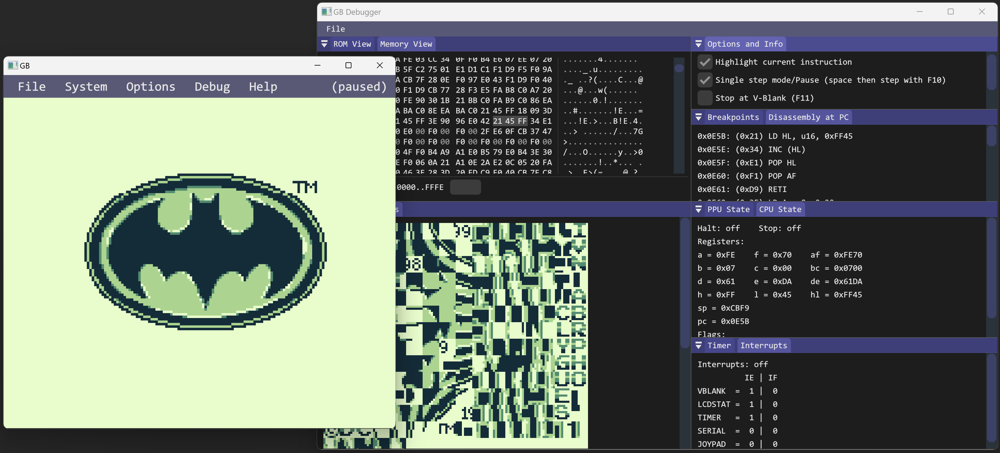

# GB - GameBoy Emulator



GB is a simple proof of concept GameBoy emulator for Windows in alpha state.

The emulator itself, `gb.h` and `gb.c`, is written in pure C11 while all surrounding glue, UI, and windowing code is in C-like C++ (this is because ImGui does not compile in C mode).

GB currently takes shortcuts:

- It is instruction-stepped and not cycle-stepped and therefore can't be accurate.
- Complete scan lines are rendered at the beginning of the LCD's VRAM scan mode instead of squeezing pixel after pixel out of the FIFO at subsequent ticks of the clock.
- No multiplayer. The serial port is not implemented.
- A lot of known hardware bugs and obscure behavior of the GameBoy are not implemented.
- Only support for DMG. No support for GameBoy Color, Super GameBoy, or GameBoy Pocket.

While not accurate nor complete, GB was play tested on and is solid enough to play the games I loved as a kid: Adventure Island 1 & 2, Batman, Batman - Return of the Joker, Donkey Kong, Donkey Kong Land, Duck Tales 1 & 2, Jurassic Park 2, Motocross Maniacs, Nintendo World Cup, Super Mario Land 1 & 2, Tiny Toon Adventures, Tom & Jerry, Wario Land, and of course Tetris.

GB also passes [Blargg's](https://github.com/retrio/gb-test-roms/tree/master) CPU instruction tests (but not most other Blargg tests due to instruction-stepping).

## License & Dependencies

GB is under [MIT license](LICENSE).

The project ships with third-party dependencies, each of which has independent licensing (see [`external`](external) directory):

- [SDL](https://libsdl.org/)
- [ImGui](https://github.com/ocornut/imgui)
- [DMCA Sans Serif font](https://web.archive.org/web/20210127100531/https://typedesign.netlify.app/dmcasansserif.html)

## Building on Windows

Windows is the only supported OS.

You require the [ImGui](https://github.com/ocornut/imgui) and [imgui_club](https://github.com/ocornut/imgui_club) (for the hex editor) sub-modules:

```bash
git submodule init && git submodule update
```

The build is triggered via the `build_win_x64.bat` batch script ([I'm really sick of CMake and the like](http://www.youtube.com/watch?v=Ee3EtYb8d1o&t=19m45s)) and can either use Clang or the Visual Studio Compiler.

### Visual Studio

```bash
shell_msvc.bat
build_win_x64.bat Msvc All Rel
```

`shell_msvc.bat` sets up the development environment (you might have to open it and adjust the path to `vcvarsall.bat` on your system depending on the Visual Studio version).

### Clang

```bash
build_win_x64.bat Clang All Rel:
```

### Development & Debugging

You can call the build script with these options: `build_win_x64.bat (Clang|Msvc) (Rel|Deb)`.

- `Clang` or `Msvc` to choose the compiler.
- `Rel` or `Deb` for release or debug flags.

For debugging call `devenv build\gb.exe` in the project directory (make sure `msvc_shell.bat` has been called first).

When running any of the [Blargg test ROMs](https://github.com/retrio/gb-test-roms/tree/master), set the `BLARGG_TEST_ENABLE` macro to `1` in [`code/gb.c`](code/gb.c) (otherwise, loading the ROM fails because its checksum is wrong/missing).
If you want to see the output of the Blargg tests written to the serial port of the GameBoy in the terminal, the build script needs to be modified to use `SUBSYSTEM:console` (otherwise, the `printf` output won't show).

## Known Issues & TODO

- There is sometimes a flickering line in the status bar in Super Mario Land.
  Currently the PPU advances after instruction execution and scan lines are rendered in entirety at the beginning of the VRAM scan mode. Rendering a scan line at the end of VRAM scan mode instead causes a similarly flickering line in Castelian.
  Such problems are usually timing issues that cause LCD registers to change too early or too late, e.g., when the GameBoy's window is disabled, with respect to when scan lines are rendered.
  I assume that properly implementing the pixel FIFO and having rendering interleaved/simultaneously with normal CPU operation would solve all such problems (maybe cycle-stepping is necessary too).
- Blargg's memory timing tests fail because GB is instruction-stepped.
  These tests look at a scenario where the timer updates in the middle of an instruction and then read the register that contains the timer.
  The result depends on what exact cycle the read/write operations and the timer update happen on.
  Cycle-stepping is required for this to work accurately but is currently missing.
  ([Here](https://www.reddit.com/r/EmuDev/comments/j4xn0s/gb_how_to_get_correct_memory_timings), [here](https://www.reddit.com/r/EmuDev/comments/pnruwk/gbgbc_passing_all_cputiming_tests), and [here](https://github.com/retrio/gb-test-roms/blob/master/mem_timing/readme.txt) are some details.)
- Serial transfer is not supported.
  Right now, as a workaround, if a serial transfer is triggered by writing `0x81` to SC, an interrupt will be triggered after the (hopefully) correct time period, and one can then read `0xFF` from SB.
  This emulates the "no link cable connected" scenario.
  This hacky solution prevents infinite loops in certain games.
  Tetris, for example, waits for a serial transfer interrupt when selecting the 2-player menu option.
  Balloon Kid, on other hand, still freezes when selecting the versus mode in the menu.
- The logo animation on the title screen of Balloon Kid is incorrect.
  SameBoy and VBA seem to emulate this correctly. BGB does something a little bit different on each reset.
  Likely this is an interrupt timing issue which is hard to fix with the current renderer that writes an entire scan line at a time.
- Audio pops/clicks/cracks.
  Other emulators have them too, some more and some less.
  Also the real GameBoy has this (to an extent).
  I'm not an audio expert and don't really know how to go about solving this.
- There are plenty more TODO notes/comments in the source code.

## Inspiration and Helpful Resources for GameBoy Emulator Development

- GameBoy CPU Manual (which is full of errors and wrong information)
- [GameBoy Emulation in JavaScript](https://imrannazar.com/series/gameboy-emulation-in-javascript)
- [GBDev Pandocs](https://gbdev.io/pandocs)
- [The Ultimate Game Boy Talk](https://www.youtube.com/watch?v=HyzD8pNlpwI)
- [gbops](https://izik1.github.io/gbops)
- [Blargg's Testing ROMs](https://github.com/retrio/gb-test-roms/tree/master)
- [BGB](https://bgb.bircd.org)
- [Dromaius](https://github.com/ThomasRinsma/dromaius)
- [GBDev Wiki](https://gbdev.gg8.se/wiki/articles/Main_Page)
- [Cinoop](https://cturt.github.io/cinoop.html)
- [Visual Boy Advance](https://github.com/visualboyadvance-m/visualboyadvance-m)
- [The Gameboy Emulator Development Guide](https://hacktix.github.io/GBEDG)
- [Argentum](https://github.com/NightShade256/Argentum)
- [Game Boy: Complete Technical Reference](https://github.com/Gekkio/gb-ctr)
- [The Cycle-Accurate Game Boy Docs](https://github.com/AntonioND/giibiiadvance/blob/master/docs/TCAGBD.pdf)

