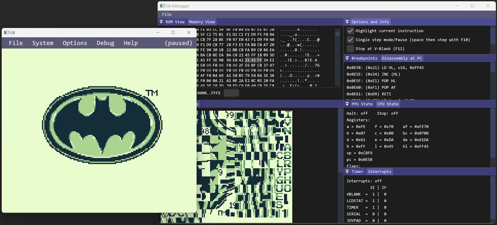

# GB - GameBoy Emulator



GB is a simple proof of concept GameBoy emulator for Windows.

The emulator itself, `gb.h` and `gb.c`, is written in pure C11 while all surrounding glue, UI, windowing code, etc. is in C-like C++ (this is because ImGui does not compile in C mode).

GB takes shortcuts:

- It is instruction-stepped and not cycle-stepped and therefore can't be accurate.
- Complete scan lines are rendered at the beginning of the LCD's VRAM scan mode instead of squeezing pixel after pixel out of the FIFO at subsequent ticks of the clock.
- No multiplayer. The serial port is not implemented.
- A lot of known hardware bugs and obscure GameBoy behaviors are not implemented.
- Only DMG support, not GameBoy Color, Super GameBoy, or GameBoy Pocket.

While not accurate nor complete, it was play tested on and solid enough to play the games I loved as a kid: Adventure Island 1 & 2, Batman, Batman - Return of the Joker, Donkey Kong, Donkey Kong Land, Duck Tales 1 & 2, Jurassic Park 2, Motocross Maniacs, Nintendo World Cup, Super Mario Land 1 & 2, Tiny Toon Adventures, Tom & Jerry, Wario Land, and of course Tetris.

GB also passes [Blargg's](https://github.com/retrio/gb-test-roms/tree/master) CPU instruction tests (but not most other Blargg tests due to being instruction-stepped).

## Dependencies

This project is shipped with third-party dependencies, each of which have independent licensing (see [`external`](external) directory):

- [SDL](https://libsdl.org/)
- [ImGui](https://github.com/ocornut/imgui)
- [DMCA Sans Serif font](https://web.archive.org/web/20210127100531/https://typedesign.netlify.app/dmcasansserif.html)

## Building on Windows

Windows is the only supported OS.

You require the [ImGui](https://github.com/ocornut/imgui) and [imgui_club][https://github.com/ocornut/imgui_club] (for the hex editor) sub-modules:

```
git submodule init && git submodule update
```

The build is triggered via the `build_win_x64.bat` batch script ([I'm really sick of CMake and the like](http://www.youtube.com/watch?v=Ee3EtYb8d1o&t=19m45s)) and can either use Clang or the Visual Studio Compiler.

### Clang

Execute `build_win_x64.bat Clang All Rel`.

### Visual Studio

Call `shell_msvc.bat` to setup the development environment (you might have to open it and adjust the path to `vcvarsall.bat` on your system depending on the Visual Studio version), then execute `build_win_x64.bat Msvc All Rel`.

### Development & Debugging

The build script can be called with these options: `build_win_x64.bat (Clang|Msvc) (Rel|Deb)`.

- `Clang` or `Msvc` to choose the compiler
- `Rel` or `Deb` for release or debug flags

For debugging call `devenv build\gb.exe` in the project directory (make sure `msvc_shell.bat` has been called first).

When running any of the [Blargg test ROMs](https://github.com/retrio/gb-test-roms/tree/master), set the `BLARGG_TEST_ENABLE` macro to `1` in [`code/gb.c`](code/gb.c) (otherwise, loading the ROM fails because its checksum is wrong/missing).
If you want to see the output of the Blargg tests written to the serial port of the GameBoy in the terminal, the build script needs to be modified to use `SUBSYSTEM:console` (otherwise, the `printf` output won't show).

## Known Issues & TODO

TODO: split this into a different file.
TODO: list which blargg tests actually work
TODO: audio pops/clicks/cracks
TODO: super mario status bar flicker

### Blargg Tests Fail Because gb Is Instruction-Stepped

Blargg's memory timing tests fail. This is because the emulator is instruction-stepped and not cycle-stepped. The tests look at the scenario where the timer is updated in the middle of an instruction and reading the register that contains the timer. Now the result depends on the exact cycles when the read/write and the timer update happen. This is currently not supported. See these sources here for a better explanation.

- https://www.reddit.com/r/EmuDev/comments/j4xn0s/gb_how_to_get_correct_memory_timings
- https://www.reddit.com/r/EmuDev/comments/pnruwk/gbgbc_passing_all_cputiming_tests
- https://github.com/retrio/gb-test-roms/blob/master/mem_timing/readme.txt (read the "Internal Operation" section)

### Serial Transfer

Serial transfer is not supported.
If triggered by writing 0x81 to SC, a interrupt will be triggered after the (hopefully) correct time period, and one can read 0xFF from SB.
This emulates the "no link cable connected" scenario.

The current solution is a quick hack but it prevents infinite loops in certain games.
Tetris, for example, waits for a serial transfer interrupt when selecting the 2-player  menu option.

### Balloon Kid

The logo animation on the title screen is incorrect.
SameBoy and VBA have this right, but bgb does something a little bit different on each reset.
This is likely is an interrupt timing issue.
Not sure this is easily fixable with the current renderer that writes an entire scan line at a time.

Also, selecting the vs. mode in the menu freezes the game.
Likely a serial transfer related issue, 

## Resources

TODO: cleanup or remove

GameBoy CPU Manual
GameBoy Programming Manual
https://izik1.github.io/gbops/
blargg
cinoop
https://github.com/ThomasRinsma/dromaius
consider switching to clang-cl instead of clang (then you can just use the same compile params as for msvc)
vba
argentum

